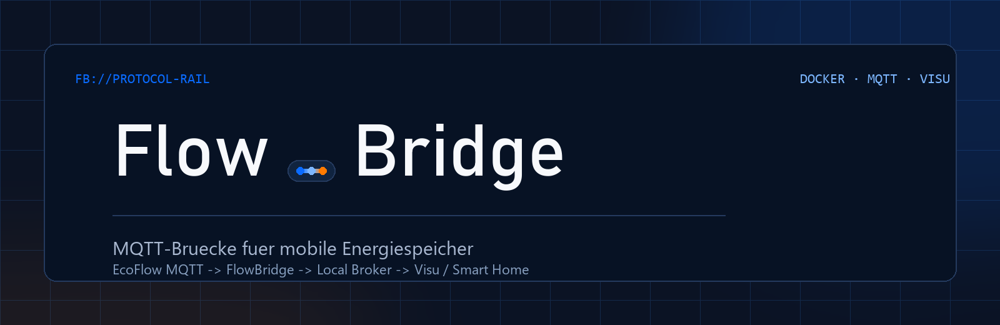
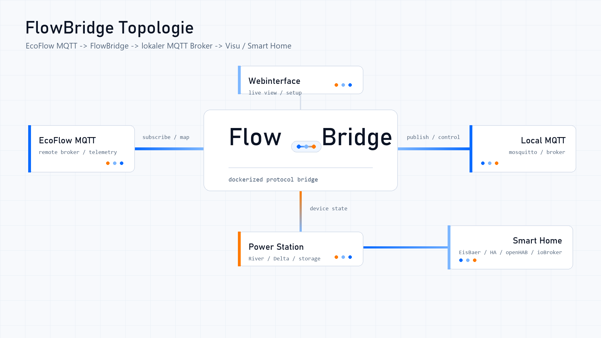

<p align="center">
  
</p>

<p align="center">
  <strong>MQTT-Brücke für mobile Energiespeicher von EcoFlow.</strong><br>
  <em>MQTT bridge for portable power stations by EcoFlow.</em>
</p>

<p align="center">
  <a href="https://hub.docker.com/r/cheetahlab/flowbridge"></a>
  <a href="https://hub.docker.com/r/cheetahlab/flowbridge/tags"></a>
  <a href="LICENSE"></a>
</p>

---

FlowBridge liest deinen EcoFlow-Speicher über die offizielle
[EcoFlow IoT Open Platform](https://developer-eu.ecoflow.com/) aus und
spiegelt ihn auf **deinen eigenen MQTT-Broker** — Mosquitto, Home Assistant,
EisBär SCADA, was immer bei dir läuft. Dazu ein Web-Dashboard mit Live-Werten
und Steuerung.

**Deine Daten bleiben im Haus.** FlowBridge redet mit der EcoFlow-Cloud und
mit deinem Broker. Sonst mit niemandem — bis auf die Update-Prüfung, die eine
öffentliche Versionsliste abruft und abschaltbar ist.

## Schnellstart

Das Abbild liegt auf **Docker Hub** und lässt sich direkt ziehen:

```bash
docker pull cheetahlab/flowbridge:latest
```

Oder gleich als `compose.yaml`:

```yaml
services:
  flowbridge:
    image: cheetahlab/flowbridge:latest
    container_name: flowbridge
    restart: unless-stopped
    ports:
      - "8081:8080"
    environment:
      FLOWBRIDGE_CONFIG: /config/config.yaml
      TZ: Europe/Berlin
      FLOWBRIDGE_PASSWORD: "ein-gutes-passwort"
    volumes:
      - ./data:/config
```

```bash
docker compose up -d
```

Danach `http://<host>:8081` aufrufen — der Rest läuft über den
Einrichtungsdialog. Du brauchst einen **Access- und Secret-Key** aus dem
EcoFlow-Entwicklerportal; das sind nicht deine App-Zugangsdaten, sondern
werden dort eigens erzeugt.

`FLOWBRIDGE_PASSWORD` schützt die Oberfläche vom ersten Start an. FlowBridge
kann Ausgänge schalten — ohne Passwort könnte das jeder im selben Netz. Die
Zeile darf raus, sobald es einmal gelaufen ist; das Passwort liegt dann
gehasht im Datenordner.

> **Synology:** Es gibt eine ausführliche Schritt-für-Schritt-Anleitung —
> [`docs/inbetriebnahme-synology.html`](docs/inbetriebnahme-synology.html).
> GitHub zeigt HTML-Dateien nur als Quelltext an; die Datei also herunterladen
> und im Browser öffnen.
> Im Container Manager findet die Registrierungs-Suche `cheetahlab/flowbridge`
> direkt.

## Unterstützte Geräte

| Modell | Stand |
|---|---|
| **RIVER 2 Pro** | an echter Hardware verifiziert |
| **DELTA 2** | nach Dokumentation vorbereitet, nie an einem Gerät gelaufen |

Andere Modelle zeigen ihre Werte an, nehmen aber möglicherweise keine Befehle
an. Der Diagnosebericht sagt das ausdrücklich (`documented` statt `verified`),
statt es zu verschweigen.

## Was es kann

- **Live-Werte über MQTT-Push** statt Abfragen — Sekunden, nicht Minuten
- **Steuern**: AC-Ausgang, 12-V-Ausgang, X-Boost, Ladelimit, Entladelimit,
  Ladeleistung, Ladepause — über die Oberfläche oder über MQTT, beides durch
  denselben Code
- **Home-Assistant-Discovery** — die Geräte tauchen von selbst auf
- **Topic-Export für EisBär SCADA** (Kanal-CSV + Payload-Profil-XML)
- **Feldinventar**: hält über Monate fest, welche Felder dein Gerät wirklich
  liefert — sichtbar wird damit, was eine Firmware still hinzufügt oder wegnimmt
- **Diagnose-Paket**: Bericht, maskierte Konfiguration, Topics und Protokoll in
  einem ZIP — Schlüssel geschwärzt, Seriennummern durch Platzhalter ersetzt
- **Oberfläche auf Deutsch und Englisch**, Hell und Dunkel, dauerhaft einstellbar

## Wie es zusammenhängt

<p align="center">
  <picture>
    <source media="(prefers-color-scheme: dark)" srcset="assets/topology/flowbridge-topology-dark.png">
    
  </picture>
</p>

## Was das Gerät nicht hergibt

Ehrlichkeit gehört zum Bild: Manches gibt die offizielle Schnittstelle schlicht
nicht her, und FlowBridge tut nicht so, als läge es an ihm.

- **Batterietemperatur und Ladezyklen** liefert die EcoFlow IoT Open Platform
  nicht — weder über REST noch über den Push. Über einen vollen Ladezyklus
  bestätigt (acht Stunden, kein einziges neues Feld). *Das Gerät kennt diese
  Werte; die offizielle Schnittstelle reicht sie nur nicht durch* — ein alter
  Payload-Satz aus dem inoffiziellen App-Protokoll enthielt sie sehr wohl.
- **Gesetzte Sollwerte** lassen sich beim River 2 Pro nicht zurücklesen.
  FlowBridge merkt sich deshalb, was es zuletzt gesetzt hat.
- **Die Backup-Reserve** nimmt das River 2 Pro über die offene Schnittstelle
  nicht an (am Gerät gemessen). Sie wird deshalb nur angezeigt, nicht bedient.
- **EcoFlow meldet auch dann Erfolg**, wenn das Gerät einen Befehl still
  verwirft. Ein grünes Ergebnis ist kein Beweis — nur eine sichtbare Wirkung.

Einzelheiten in [`docs/quota-fields-river2.md`](docs/quota-fields-river2.md).

## Dokumentation

| | |
|---|---|
| [Inbetriebnahme auf einer Synology](docs/inbetriebnahme-synology.html) | Schritt für Schritt (HTML — herunterladen und im Browser öffnen) |
| [MQTT-Topics](docs/mqtt-topics.md) | vollständige Topic-Liste |
| [Feldabgleich River 2 Pro](docs/quota-fields-river2.md) | was die Schnittstelle liefert — und was nicht |

Dieses Repository ist ein **Spiegel**, kein Arbeitsverzeichnis: Jede
veröffentlichte Fassung steht hier als ein Commit, die eigentliche Entwicklung
läuft woanders. Was sich zwischen zwei Fassungen geändert hat, zeigt deshalb
der Vergleich zweier Commits — die Nummer dazu steht in [`VERSION`](VERSION)
und als unveränderliche Marke am zugehörigen Abbild auf Docker Hub.

## Lokale Entwicklung

### Wo was liegt

| | |
|---|---|
| `src/app.py` | FastAPI: Endpunkte, Aufsichtsschleife, Zustand, liefert das gebaute Frontend aus |
| `src/ecoflow_client.py` | REST-Client (HMAC-SHA256-Signierung, Zertifikat- und Quota-Abruf) |
| `src/ecoflow_mqtt.py` | Push-Kanal der EcoFlow-Cloud |
| `src/mqtt_bridge.py` | Publish zum lokalen Broker + Befehle abonnieren |
| `src/device.py` | Normalisierung der Quota-Felder — fehlende Felder werden weggelassen, nicht erfunden |
| `src/commands_*.py` | Befehle je Modell; was ein Gerät nicht annimmt, steht dort als `NUR_LESBAR` |
| `src/diagnostics.py` | Protokoll, Schwärzung, Diagnosepaket |
| `src/inventar.py` | Feldinventar |
| `src/exporters.py`, `src/ha_discovery.py` | EisBär-Export, Home-Assistant-Discovery |
| `frontend/` | React + Vite + TypeScript |
| `tests/` | 341 Tests, `pytest` |

```bash
pip install -r requirements.txt
cd src && uvicorn app:app --reload --port 8000
```

```bash
cd frontend
npm install
npm run dev
```

### Versions-Hook aktivieren (einmalig pro Klon)

```bash
git config core.hooksPath scripts/githooks
```

Der `pre-commit`-Hook schreibt die Versionsnummer nach `VERSION` und legt sie in
denselben Commit. Schema `JAHR.MONAT.TAG-ZAEHLER` (z. B. `2026.08.13-02`), der
Zähler ist der wievielte Commit des Tages. Ohne aktivierten Hook bleibt die
Nummer stehen und die Oberfläche meldet eine veraltete Version.

Davor führt der Hook jedes Skript in `scripts/pre-commit.d/` aus, falls es
diesen Ordner gibt — gedacht für eigene Zusatzschritte. Zum Bauen und
Mitarbeiten wird er nicht gebraucht; fehlt er, entfällt der Schritt.

## Zugriffsschutz

FlowBridge ist mit **einem Passwort** geschützt (keine Benutzerkonten – es ist
ein Gerät im eigenen Netz, kein Mehrbenutzer-Dienst). Beim ersten Start
verlangt die Oberfläche, eines zu vergeben; solange keines gesetzt ist, liefert
die HTTP-Schnittstelle **gar keine Daten**.

Im Container lässt sich das Passwort gleich beim ersten Start setzen:

```yaml
environment:
  - FLOWBRIDGE_PASSWORD=dein-passwort
```

Damit entfällt das Zeitfenster, in dem FlowBridge zwar läuft, aber noch kein
Passwort vergeben ist. Ein bereits gesetztes Passwort wird dadurch **nicht**
überschrieben.

Vergessen? Den `auth`-Block aus der `config.yaml` löschen und neu starten.

**Wichtig:** FlowBridge spricht HTTP. Im eigenen LAN ist das vertretbar, über
das Internet gehört ein Reverse Proxy mit TLS davor – sonst geht das Passwort
im Klartext über die Leitung.

Die MQTT-Seite schützt das **nicht**: Wer auf deinen Broker schreiben darf,
darf auch Befehle senden. Das ist Sache der Broker-Rechte (Mosquitto-ACL), und
dort gehört es auch hin.

## Diagnose

Läuft etwas nicht, liefert das **Diagnose-Paket** in den Einstellungen alles,
was zur Ferndiagnose nötig ist: Version, maskierte Konfiguration, Zustand der
drei Verbindungen, Feldzahl je Gerät und das Protokoll — als eine ZIP-Datei
zum Verschicken.

Ablauf: *Protokoll einschalten → Fehler nachstellen → Paket herunterladen*.

Die letzten Zeilen laufen **immer** im Speicher mit, auch ohne eingeschaltetes
Protokoll. Sonst hülfe der Schalter nicht: Wer den Fehler sieht, schaltet erst
danach ein — und dann kommt er eine Stunde nicht wieder.

Das Datei-Protokoll liegt neben der `config.yaml` (im Container also unter
`/config/flowbridge.log`), begrenzt auf 5 × 5 MB mit Rotation.

Umgeschaltet wird nach **Größe**, nicht nach Zeit. Bei der gemessenen
Schreibrate reicht es rund **drei bis vier Tage** zurück; garantiert sind die
vier vollen Stände (~85 h), denn direkt nach einer Umschaltung ist die neueste
Datei leer. Ältere Stände werden dabei stillschweigend gelöscht — ein Ereignis
von vorletzter Woche steht also nicht mehr drin.

**Schlüssel, Passwörter und Signaturen werden geschwärzt**, bevor irgendetwas
geschrieben wird — schon in der Datei auf der Platte, nicht erst beim Packen.
Das ist kein Beiwerk: Diese Datei geht per E-Mail durchs Internet, und mit den
EcoFlow-Schlüsseln hätte der Empfänger die Kontrolle über den Speicher.

**Seriennummer und EcoFlow-Kontokennung stehen als `<GERAET-1>` und `<KONTO>`
darin**, nicht im Klartext. Auswertbar bleibt das Paket trotzdem: Welches
Modell hinter welchem Platzhalter steckt, liegt als eigene Zuordnung bei —
das ist die Angabe, die zur Analyse gebraucht wird, und sie identifiziert kein
Gerät.

## Feldinventar

Ein zweites, unabhängiges Protokoll — nicht zur Fehlersuche, sondern zur
Langzeitbeobachtung: **Welche Felder liefert EcoFlow eigentlich?**

Anlass war ein Abgleich am 13.08.2026: Von 168 Feldern eines alten
Payload-Satzes kommen über die offizielle Schnittstelle noch 27 an. Solche
Verschiebungen passieren still — EcoFlow spielt Firmware aus, und der
Datenstrom wird breiter oder schmaler.

Der Kniff: Dafür braucht es nicht den Datenstrom, sondern ein Inventar. Je
Feld nur *zuerst gesehen*, *zuletzt gesehen*, *Anzahl*, *Wertebereich* — das
sind wenige Kilobyte, dauerhaft. Die Datei wächst nur, wenn ein **neues** Feld
auftaucht; dann wird zusätzlich die erste Rohnachricht mitgeschrieben.

- Neues Feld → `zuerst` trägt das heutige Datum
- Weggefallenes Feld → `zuletzt` bleibt stehen und altert

Erfasst werden **beide** Kanäle mit Herkunftsvermerk (`push` / `rest`). Das ist
nicht kosmetisch: Der MQTT-Push liefert nachweislich mehr Felder als
`quota/all` (29 gegen 20, gemessen am 13.08.2026).

Einzuschalten in den Einstellungen, Ablage als `feldinventar.json` neben der
`config.yaml` — übersteht also Neustarts und Container-Updates.

**Nicht geschwärzt**, anders als das Diagnose-Paket: Hier stehen Feldnamen und
Messwerte, keine Zugangsdaten.

## Selbst bauen

```bash
docker compose -f docker/flowbridge/compose.build.yaml up -d --build
```

Baut das Abbild aus diesem Verzeichnis, ohne eine Registry anzufassen.
Für die Versionsnummer im Abbild muss der Versions-Hook aktiv sein (siehe
oben) — sonst meldet die Oberfläche eine veraltete Fassung.

## Konfiguration

Siehe `src/config.example.yaml` als Referenz. `config.yaml` wird normalerweise
ausschließlich über das Setup-UI erzeugt und ist gitignored.

## Lizenz

**GNU AGPL v3** – siehe [`LICENSE`](LICENSE), Urhebervermerk und Ausnahmen in
[`NOTICE.md`](NOTICE.md).

Benutzen, betreiben und für dich anpassen: frei und ohne Bedingungen. Wer
FlowBridge **verändert weitergibt oder als Dienst betreibt**, muss den
geänderten Quelltext unter derselben Lizenz zugänglich machen — auch dann,
wenn er die Software selbst gar nicht herausgibt. Das ist der Unterschied der
AGPL zur gewöhnlichen GPL, und für eine Weboberfläche wie diese der
entscheidende.

Kommerzielle Nutzung unter anderen Bedingungen ist verhandelbar — der Urheber
ist alleiniger Rechteinhaber (siehe [`NOTICE.md`](NOTICE.md)).

Die verwendeten Bibliotheken sind sämtlich permissiv lizenziert (MIT, BSD-3,
Apache-2.0, PSF) — deshalb war der Wechsel überhaupt möglich: Permissive
Lizenzen stellen keine Bedingung an die Lizenz des Gesamtwerks. `paho-mqtt`
ist doppelt lizenziert und wird hier unter BSD-3-Clause genutzt, `certifi`
steht unter MPL-2.0 (dateibezogenes Copyleft) und wird unverändert
mitgeliefert. Die vollständige Aufstellung mit Versionen steht in
[`THIRD-PARTY-NOTICES.md`](THIRD-PARTY-NOTICES.md) und gehört bei jeder
Änderung an `requirements.txt` oder `frontend/package.json` nachgezogen.

Nicht von der Lizenz erfasst sind **Name und Logo**. Eine Abwandlung darf gern
entstehen, sollte aber anders heißen — sonst tragen zwei verschiedene
Programme denselben Namen.

FlowBridge ist ein unabhängiges Projekt und steht in keiner Verbindung zu
EcoFlow. Die Nutzung der EcoFlow IoT Open Platform unterliegt deren eigenen
Bedingungen; die Lizenz dieses Projekts ändert daran nichts.
